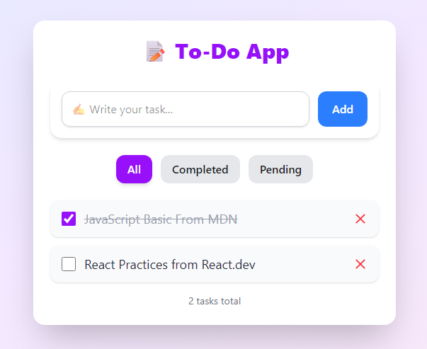
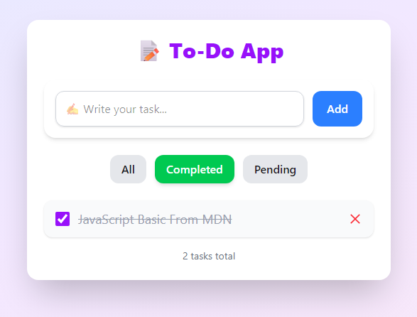
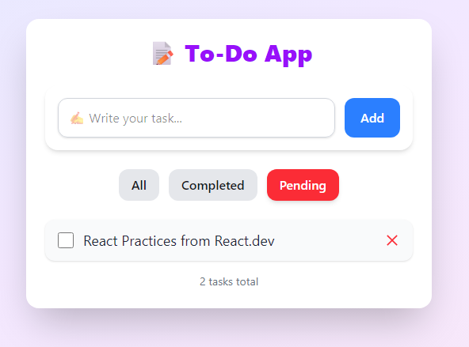

# 📝 React To-Do App

[](https://reactjs.org/)
[](https://tailwindcss.com/)
[](LICENSE)

A modern, responsive **To-Do App built with React and Tailwind CSS**.  
It allows users to manage tasks efficiently with features like adding, completing, deleting, and filtering tasks.  
All tasks are saved in the browser using **LocalStorage**, so they persist even after refreshing the page.

---

## 🔹 Features

- **Add Tasks:** Quickly add tasks using the input field.  
- **Mark as Completed:** Toggle tasks as completed or pending using checkboxes.  
- **Delete Tasks:** Remove tasks easily with a single click.  
- **Filter Tasks:** View **All**, **Completed**, or **Pending** tasks.  
- **Persistent Storage:** Tasks are automatically saved in LocalStorage.

---

## 🖼 Screenshots

### All Tasks
  

### Completed Tasks
  

### Pending Tasks
  

---

## 🚀 Installation & Usage

1. **Clone the repository:**

```bash
git clone https://github.com/your-username/todo-app.git
cd todo-app
```
2.**Install dependencies:**
```bash
npm install
```
3.**start the development server:**
```bash
npm start
```
4. **Manage your tasks:**
 Add new tasks, mark them as completed, delete them, and filter your list easily.

## 💻 Technologies Used
- **React:** Component-based UI library.  
- **Tailwind CSS:** Utility-first UI libray.  
- **LocalStorage:** Browser-based storage for persistant task.  

## 📂 Project Structure
   todo-app/
├─ src/
│  ├─ Components/
│  │  ├─ Input/
│  │  └─ ToDo/
│  ├─ App.jsx
│  └─ index.js
├─ public/
├─ package.json
└─ README.md

## ⚖️ License
This project is open-source and free to use for learning and personal projects.
Licensed under the MIT License – see the LICENSE file for details.
